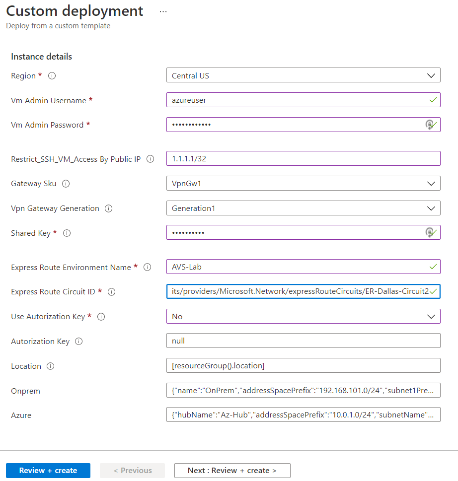
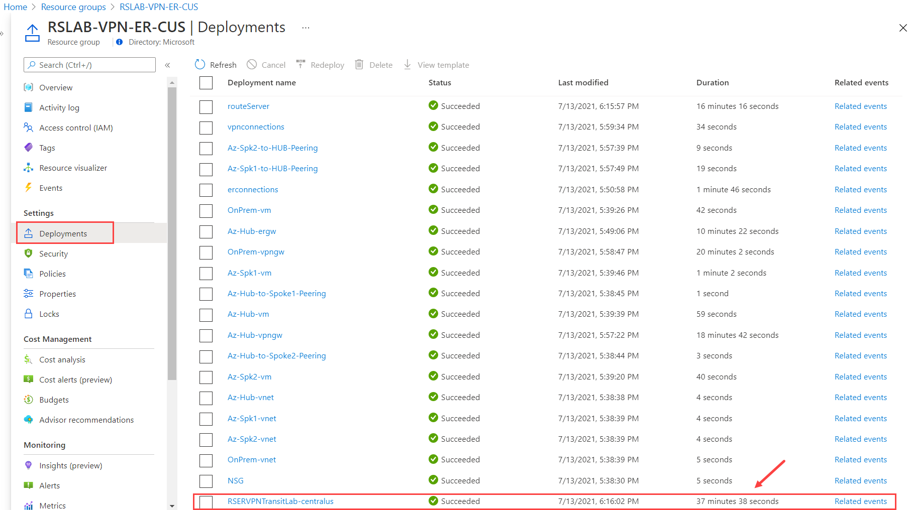

# Transit between ExpressRoute and Azure S2S VPN using Route Server

**Contents**

[Concepts](#Concepts)

[Deploy this solution](#Deploy-this-solution)

[LAB steps](#LAB-steps)

[Clean up](#Clean-up)

[Acknowledgments](#Acknowledgments)

## Concepts

Azure Route Server (ARS) is a new Azure Network feature made available recently. One of its main features is to allow BGP peering between Network Virtual Appliances (NVAs) and Azure Virtual Network and consequently route exchange between them. Additionally, ARS enables transit was to allow transit between Virtual Network Gateways ExpressRoute and VPN  which before was not possible. For more information about this feature, consult [About Azure Route Server (Preview) support for ExpressRoute and Azure VPN](https://docs.microsoft.com/en-us/azure/route-server/expressroute-vpn-support).

**Note:** Azure Route Server is currently in Public Preview. Therefore, verify Azure Route Server [documentation](https://docs.microsoft.com/en-us/azure/route-server/overview) for the most current status and when it will be made generally available (GA).

Several scenarios can benefit from having ARS to allow VPN and ExpressRoute transit. For example, Azure Vmware Solutions (AVS), HANA Large Instances (HLI), Skytap, and others. Most of those solutions use ExpressRoute Connections (basically, an ExpressRoute circuit connected to an ExpressRoute Gateway) to integrate with Azure Virtual Network. Customers may have an existing VPN connection from their on-premises location to Azure and want to make sure they can access those environments via Azure. 
Another common scenario, ARS can allow customers who already have their on-premises Datacenters already connected to Azure using ExpressRoute to transit over other remote locations. For example, a customer branches via VPN (using Microsoft Network backbone as transit) or other providers or customers towards a B2B scenario.

This lab intends to help you to build a Lab environment to simulate transit between ExpressRoute and VPN by creating the environment integrally as well as emulate an on-premises environment to give you the capability to demonstrate and validate the transit functionality made possible by ARS.

### Architecture diagram


## Deploy this solution

[](https://portal.azure.com/#create/Microsoft.Template/uri/https%3A%2F%2Fraw.githubusercontent.com%2Fdmauser%2FLab%2Fmaster%2FRS-ER-VPN-Gateway-Transit%2Fazuredeploy.json)
[](http://armviz.io/#/?load=https%3A%2F%2Fraw.githubusercontent.com%2Fdmauser%2FLab%2Fmaster%2FRS-ER-VPN-Gateway-Transit%2Fazuredeploy.json)

**Note:** The template provisioning takes approximately 40-50 minutes to complete.

## Solution components

The components that you can deployed are exactly what is shown above on the Architecture Diagram:

1. **Azure Hub VNET** (10.0.1.0/24) and subnets (subnet1, RouteServerSubnet, GatewaySubnet)
2. **Azure Spoke1** (10.0.2.0/24) and subnet1
3. **Azure Spoke2** (10.0.3.0/24) and subnet1
4. Emulated **On-premises** on Azure (192.168.101.0/24) and subnet1
5. **VPN Gateways:** Azure-VPN-Gateway and Onprem-VPN-Gateway with VPN connection and BGP (Azure AS: 65515 and Onprem AS: 65002). Note: this solution uses BGP (dynamic routing), but transit with ARS is also possible when VPN Gateway uses static routing IPSec tunnels. Defined static over Local Network Gateway are also propagated via iBGP from VPN Gateway to Azure Route Server, and than propagated to ExpressRoute Gateway.
6. **ExpressRoute Gateway:** Azure-ergw and connection to specified ExpressRoute ResourceID.
7. **Azure Route Server** with *branch to branch enabled* to allow transit between ExpressRoute gateways and VPN Gateway.
8. Virtual Machines provisioned: **Az-Hub-lxvm** (10.0.1.4), **Az-Spk1-lxvm** (10.0.2.4), **Az-Spk2-lxvm** (10.0.3.4) and **OnPrem-lxvm** (192.168.101.4).

## LAB steps

### Parameters example



### Deployment considerations

#### Defining custom network address spaces

You can change Azure and On-premises network address spaces during the deployment of the ARM Template via Portal as shown (last two entries):


Additionally, you can use **Azure CLI** by defining variables for the newer address spaces and other parameters that you want to customize. Below the sample CLI script, we have OnPrem VNET is changed to **192.168.10.0/24**, Azure Hub and Spokes 1 and 2 are changed to **10.0.10.0/24, 10.11.0.0/24**, and **10.0.12.0/24**, respectively. It is important to note that each Subnet for each VNET has to also match with that change.

```Shell
## CLI deploy example deploying using a different VNET address space (Azure and On-premises)
#Variables
rg=RSLAB-VPN-ER #Define your resource group
VMAdminUsername=dmauser #specify your user
location=centralus #Set Region
mypip=$(curl ifconfig.io -s) #captures your local Public IP and adds it to NSG to restrict access to SSH only for your Public IP.
sharedkey=$(openssl rand -base64 24) #VPN Gateways S2S shared key is automatically generated.
ERenvironmentName=AVS-CUS #Set remove environment connecting via Expressroute (Example: AVS, Skytap, HLI, OnPremDC)
ERResourceID="/subscriptions/SubID/resourceGroups/RG/providers/Microsoft.Network/expressRouteCircuits/ERCircuitName" ## ResourceID of your ExpressRoute Circuit.
UseAutorizationKey="No" #Use authorization Key, possible values Yes or No.
AutorizationKey="null" #Only add ER Authorization Key if UseAutorizationKey=Yes.

#Define emulated On-premises parameters:
OnPremName=OnPrem #On-premises Name
OnPremVnetAddressSpace=192.168.10.0/24 #On-premises VNET address space
OnPremSubnet1prefix=192.168.10.0/25 #On-premises Subnet1 address prefix
OnPremgatewaySubnetPrefix=192.168.10.128/27 #On-premises Gateways address prefix
OnPremgatewayASN=60010 #On-premises VPN Gateways ASN

#Define parameters for Azure Hub and Spokes:
AzurehubName=Az-Hub #Azure Hub Name
AzurehubaddressSpacePrefix=10.0.10.0/24 #Azure Hub VNET address space
AzurehubNamesubnetName=subnet1 #Azure Hub Subnet name where VM will be provisioned
Azurehubsubnet1Prefix=10.0.10.0/27 #Azure Hub Subnet address prefix
AzurehubgatewaySubnetPrefix=10.0.10.32/27 #Azure Hub Gateway Subnet address prefix
AzurehubrssubnetPrefix=10.0.10.64/27 #Azure Hub Route Server subnet address prefix
Azurespoke1Name=Az-Spk1 #Azure Spoke 1 name
Azurespoke1AddressSpacePrefix=10.0.11.0/24 # Azure Spoke 1 VNET address space
Azurespoke1Subnet1Prefix=10.0.11.0/27 # Azure Spoke 1 Subnet1 address prefix
Azurespoke2Name=Az-Spk2 #Azure Spoke 1 name
Azurespoke2AddressSpacePrefix=10.0.12.0/24 # Azure Spoke 1 VNET address space
Azurespoke2Subnet1Prefix=10.0.12.0/27 # Azure Spoke 1 VNET address space

#Parsing parameters above in Json format (do not change)
JsonAzure={\"hubName\":\"$AzurehubName\",\"addressSpacePrefix\":\"$AzurehubaddressSpacePrefix\",\"subnetName\":\"$AzurehubNamesubnetName\",\"subnet1Prefix\":\"$Azurehubsubnet1Prefix\",\"gatewaySubnetPrefix\":\"$AzurehubgatewaySubnetPrefix\",\"rssubnetPrefix\":\"$AzurehubrssubnetPrefix\",\"spoke1Name\":\"$Azurespoke1Name\",\"spoke1AddressSpacePrefix\":\"$Azurespoke1AddressSpacePrefix\",\"spoke1Subnet1Prefix\":\"$Azurespoke1Subnet1Prefix\",\"spoke2Name\":\"$Azurespoke2Name\",\"spoke2AddressSpacePrefix\":\"$Azurespoke2AddressSpacePrefix\",\"spoke2Subnet1Prefix\":\"$Azurespoke2Subnet1Prefix\"}
JsonOnPrem={\"name\":\"$OnPremName\",\"addressSpacePrefix\":\"$OnPremVnetAddressSpace\",\"subnet1Prefix\":\"$OnPremSubnet1prefix\",\"gatewaySubnetPrefix\":\"$OnPremgatewaySubnetPrefix\",\"asn\":\"$OnPremgatewayASN\"}

az group create --name $rg --location $location
az deployment group create --name RSERVPNTransitLab-$location --resource-group $rg \
--template-uri https://raw.githubusercontent.com/dmauser/Lab/master/RS-ER-VPN-Gateway-Transit/azuredeploy.json \
--parameters VmAdminUsername=$VMAdminUsername gatewaySku=VpnGw1 vpnGatewayGeneration=Generation1 sharedKey=$sharedkey ExpressRouteEnvironmentName=$ERenvironmentName expressRouteCircuitID=$ERResourceID UseAutorizationKey=$UseAutorizationKey UseAutorizationKey=$UseAutorizationKey Onprem=$JsonOnPrem Azure=$JsonAzure \
--no-wait
```

The Azure CLI Script also is available inside this Repo as [deploy.azcli](https://raw.githubusercontent.com/dmauser/Lab/master/RS-ER-VPN-Gateway-Transit/deploy.azcli).

#### Azure Route Server management

You may not be able to visualize Azure Route Server inside your resource group. During Public Preview Azure Route Server can be managed via portal using http://aka.ms/routeserver.

### Deployment validation

Use Azure Portal to check deployment status inside Azure Resource Group as shown below. Total deployment will be shown on the last entry (example below RSERVPNTransitLab-centralus which took 37 minutes and 38 seconds to complete the resources provisioning).



### Review Routes

- **Azure VPN Gateway** use [Portal](https://docs.microsoft.com/en-us/azure/vpn-gateway/bgp-diagnostics), PowerShell or CLI.
- **Azure ExpressRoute Gateway** PowerShell script or CLI. You can find a PowerShell script where you can dump BGP routes for both VPN and ExpressRoute Gateways, consult: [Verify BGP information on Azure VPN and ExpressRoute Gateways](https://github.com/dmauser/Lab/tree/master/VNG-BGP-Info).
- **Azure Route Server** by using CLI: _[az network routeserver peering list-advertised-routes](https://docs.microsoft.com/en-us/cli/azure/network/routeserver/peering?view=azure-cli-latest#az-network-routeserver-peering-list-advertised-routes)_ and _[az network routeserver peering list-learned-routes](https://docs.microsoft.com/en-us/cli/azure/network/routeserver/peering?view=azure-cli-latest#az_network_routeserver_peering_list_learned_routes)_

## Clean up

1. Access [Azure Preview Portal](https://preview.portal.azure.com) (Note: preview portal is requires because Azure Route Server is still in Public Preview).
2. Delete Resource Group where your resources got provisioned.

## Acknowledgments

Special thanks to [Heather Sze](https://github.com/hsze/) for validating this lab and the Networking GBB team for their insights.
