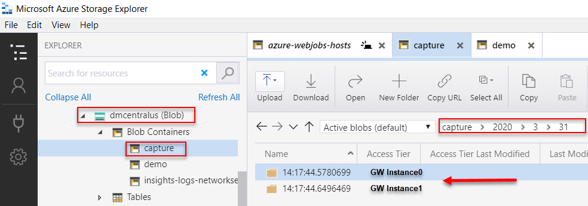

# Azure Virtual Network Gateway Packet Capture (PowerShell)

## Introduction

This is Powershell script the leverages AzVirtualnetworkGatewayPacketCapture cmdlets to facilitate network packet captures on Azure Gateways. More information: [Configure packet captures for VPN gateways](https://docs.microsoft.com/en-us/azure/vpn-gateway/packet-capture). The biggest advantage of this feature is it allows customers to obtain their own Azure VPN Gateway packet captures without open a support ticket.

  **Note:** This only works for Azure VPN Gateways and is not applicable for other types of Azure Gateways such as ExpressRoute, Application Gateway or Virtual WAN.
  For Packet capture for **Virtual WAN VPN Gateway** consult this [link](https://github.com/dmauser/Lab/tree/master/vWAN-vpn-gateway-packet-capture)


Default script behavior and features you may need adjust:

1) Azure VPN Capture for all connections (It will be added option later to select by connection)
2) Maximum Capture size is: 500 MB - You can adjust MaxFileSize parameter below and adjust it to your needs.
3) It will take Inner and Outer tunnel traffic (IPSec and traffic inside the tunnel). Adjust parameter CaptureSingleDirectionTrafficOnly to TRUE in case you need only outer traffic.
4) Packet size inside capture will be full 1500. You can adjust MaxPacketBufferSize to smaller number such as 120 to capture only Headers (it may provide better performance and more data).

If you need more information about those parameters consult: [Start-AzVirtualnetworkGatewayPacketCapture](https://docs.microsoft.com/en-us/powershell/module/az.network/start-azvirtualnetworkgatewaypacketcapture).

## Prerequisites

- Create a storage account and container on the same Resource Group as your Virtual Network Gateway. For example: capture container under Storage Account mausertest as shown:

    

- It runs only over Powershell 5.1 at this time.
- Make sure Azure Powershell cmdlets are properly installed (see: http://aka.ms/azps)
- See roadmap at bottom with new features to be added.

## Powershell Script:

You can download VNG-NetCap.ps1 or copy and paste script as shown below:

```powershell
Param(
    [Parameter(Mandatory=$true,
    HelpMessage="Add ")]
    [String]
    $VPNGWName,

    [Parameter(Mandatory=$true,
    HelpMessage="Add VPN Gateway Resource Group Name")]
    [String]
    $VPNGWRG,

    [Parameter(Mandatory=$true,
    HelpMessage="Add Storage Account Name")]
    [String]
    $StgName,

    [Parameter(Mandatory=$true,
    HelpMessage="Add Storage Account Resource Group Name")]
    [String]
    $StgRG,

    [Parameter(Mandatory=$true,
    HelpMessage="Add Storage Account blob container Name")]
    [String]
    $StgContainerName
)

# Variables that can be adjusted based in your needs.
# Filter1 gets inner and outer IPSec Tunnel traffic (Default filter used by this script).
$Filter1 = "{`"TracingFlags`": 11,`"MaxPacketBufferSize`": 120,`"MaxFileSize`": 500,`"Filters`" :[{`"CaptureSingleDirectionTrafficOnly`": false}]}" 
# Filter2 shows how to filter between IPs or Subnets.
$Filter2 = "{`"TracingFlags`": 11,`"MaxPacketBufferSize`": 120,`"MaxFileSize`": 500,`"Filters`" :[{`"SourceSubnets`":[`"10.60.4.4/32`",`"10.200.1.5/32`"],`"DestinationSubnets`":[`"10.60.4.4/32`",`"10.200.1.5/32`"],`"CaptureSingleDirectionTrafficOnly`": false}]}" # This filter gets inner and outer IPSec Tunnel traffic.
<# Few notes about filters: 
1) MaxPacketBufferSize it takes first 120 bytes. You can change it to 1500 to get full packet size in case you need to investigate the payload.
2) MaxFileSize is 500 MB.
#>
$startTime = Get-Date
$EndTime = $startTime.AddDays(1)
$ctx = (Get-AzStorageAccount -Name $StgName -ResourceGroupName $StgRG).Context
$SAStokenURL = New-AzStorageContainerSASToken  -Context $ctx -Container $StgContainerName -Permission rwd -ExpiryTime $EndTime -FullUri

# Get full VPN Gateway Capture
## Start Packet Capture
Write-Host "Please wait, starting VPN Gateway packet capture..." -ForegroundColor Yellow
Start-AzVirtualnetworkGatewayPacketCapture -ResourceGroupName $VPNGWRG -Name $VPNGWName -FilterData $Filter1

## Stop Packet Capture
Write-Host -NoNewLine 'Reproduce your issue and press any key to stop to capture...' -ForegroundColor Yellow;
$null = $Host.UI.RawUI.ReadKey('NoEcho,IncludeKeyDown');
Write-Host ""
Write-Host "Please wait, stopping VPN Gateway packet capture..." -ForegroundColor Red

Stop-AzVirtualnetworkGatewayPacketCapture -ResourceGroupName $VPNGWRG -Name $VPNGWName -SasUrl $SAStokenURL

## Retrieve your Packet Captures
Write-Host "Retrieve packet captures using Storage Explorer over:" -ForegroundColor Yellow
Write-Host "Storage account:" $StgName
Write-Host "Blob container :" $StgContainerName
```

Sample output when script runs:


## How to retrieve and review generated captures

Use Azure Storage Explorer to download the captures. Navigate on container and capture should be inside folder with date/time (UTC) as shown:



**Note** that Azure VPN Gateway always runs over two instances. In case you have Active/Passive you may see IPSec traffic only in one of the instances while when you have Active/Active configuration both of them will have IPSec traffic inside.

## Site to Site VPN Capture Example

Captures are saved on pcap format and you can use Wireshark to review them, here is an example:


- Capture above show typical IPSec IKEv2 connection establishment:
    - Phase I (Main Mode - first two frames). 
    - Phase II (Quick Mode - third and fourth frames) 
    - Data being exchanged between VPN Gateways over IPSEC ESP (NAT-T - UDP 4500 - Last four frames).

## Point to Site VPN inner capture with RADIUS Authentication Example

First section highlighs RADIUS authentication between Azure VPN Gateway Instance (10.100.1.5) and RADIUS Server (10.115.1.4).
Second part shows P2S client (172.16.0.130) sending ping to Server (10.100.0.4) inside Azure VNET.


## Roadmap

- Add support to Powershell Core 6.0.
- Add option to create Storage Account + Container.
- Add option to select Azure VPN Gateway to start captures per Connections. That will be useful for narrow down capture only for a specific Site-to-Site VPN Connection.
- Add option to include filters.
